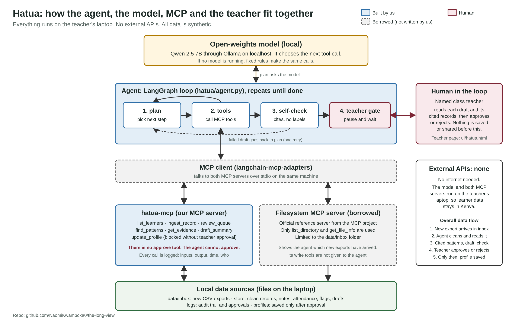
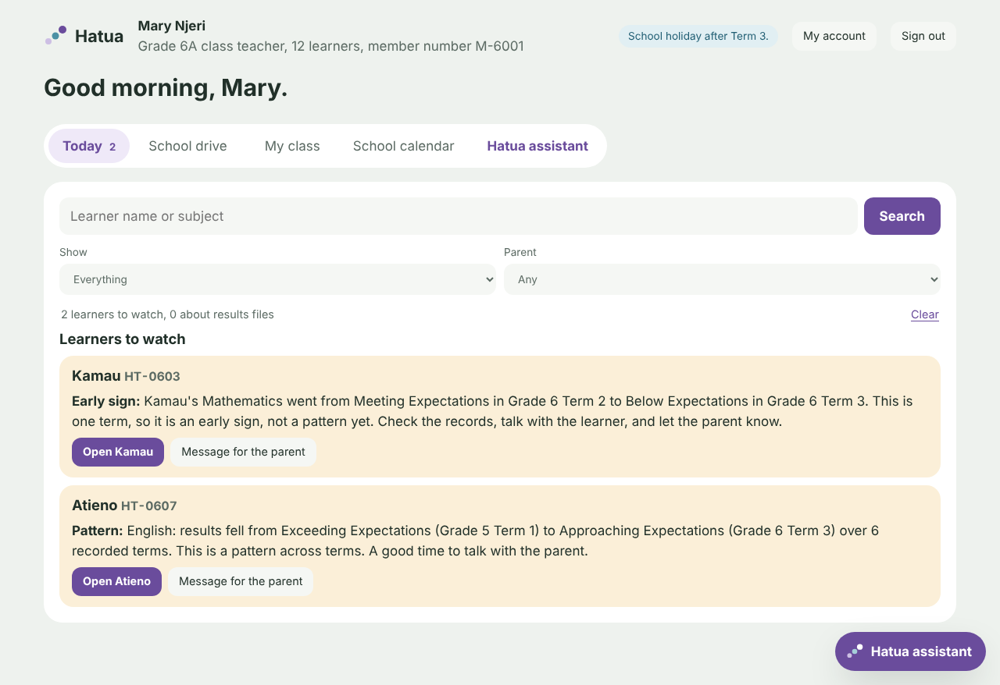

# Hatua

*Hatua kwa hatua* means "step by step" in Kiswahili. Hatua is an open-source AI agent that helps a Kenyan junior school teacher see each learner's strengths and struggles across Grades 4 to 9. Generated claims link to supporting records for a teacher to verify. Records and pending drafts stay in local files. A named teacher must approve a draft before it is added to a learner profile or used to prepare a family message.

Built for the **Education: The Long View** track of the African Agentic AI Design Challenge. Sub-theme: *Longitudinal strength tracking*, with *Plain-language reporting* in English and Kiswahili.

> All data in this repository is **synthetic**. No real learner is represented.



## Send it to a teacher

Build a ready-to-open, synthetic-only test package (Python 3.9+, no dependencies):

```bash
python scripts/package_teacher_demo.py
```

Share the [live teacher demo](https://naomikwamboka0.github.io/the-long-view/). No installation is needed. For offline use, the optional ZIP contains `index.html`. It includes a 10–15 minute walkthrough, fictional examples, practice approval and rejection, English/Kiswahili family messages, an email feedback form addressed to **ateidiana@gmail.com** (the teacher reviews and sends it in their email app), and **Privacy & data** controls. Use **Test Teacher**; no real names or school records are needed.

The package generator uses fresh synthetic records in an isolated temporary folder. It never copies your working store, profiles or audit logs. A normal `ui/hatua.html` embeds the dataset it was built from, so it must not be published or sent casually.

For a public test link, enable GitHub Actions as the Pages source and manually run **Publish synthetic teacher demo**. Use the URL returned by that deployment. See [the teacher guide](TEACHER_TEST.md), [privacy policy](PRIVACY.md) and [GitHub's Pages workflow guide](https://docs.github.com/en/pages/getting-started-with-github-pages/using-custom-workflows-with-github-pages).

## The whole-school teacher portal

```bash
python -m hatua school-demo        # then open http://127.0.0.1:8765
```

A demo school with Grades 4 to 9 and one class teacher per class. Each teacher:

- **signs in** with their own member number and PIN. A PIN handed out by the school works once: the teacher must choose their own before anything opens. Easy PINs are refused, 5 wrong PINs lock sign-in for 15 minutes, the page signs out after 15 minutes without use, and **My account** shows the teacher their own sign-ins and wrong PINs;
- sees only their own class, with the full Grade 4 to 9 history of every learner (earlier grades are read-only);
- has a **folder for each term on the school drive**, with one **Excel** results file in it (`school_drive/Grade 6/2026 Term 1/...xlsx`). The teacher **approves** a file before Hatua uses it, and approval adds only their own learners' rows;
- is told when a term's file is **missing**, and when a file they approved is **deleted from the drive**. Only that class's teacher is told. Due dates come from Kenya's 2026 school calendar;
- is told **as soon as** an approved file shows a learner falling in a subject, with a ready message for the parent in English or Kiswahili, and can record that the parent was told;
- gets a **report comment** written by Qwen on the laptop, and gives it a thumbs up (use it) or a thumbs down (why, then a new version). Comments the teacher liked shape the next ones;
- can ask the **Hatua assistant**, a chat window run by Qwen on the laptop. It **asks one short question first**, then answers about the teacher's own class, a learner, the school calendar or how to use Hatua, and cites the records it relies on. It never ranks learners;
- can open **senior school pathway ideas** for a Grade 9 learner (early ideas in Grades 7 and 8). They stay **closed until the named teacher opens them**, which is logged. Then they show the cited strengths for each of STEM, Social Sciences, and Arts and Sports Science, side by side. Hatua never picks one; the teacher raises them with the learner and guardian.

Everything runs on the laptop: no outside service, no API, not even a web font. See [docs/PORTAL.md](docs/PORTAL.md).

**To show every challenge requirement, step by step with screenshots, follow [docs/SHOW_THE_REQUIREMENTS.md](docs/SHOW_THE_REQUIREMENTS.md).**



A signed-in approval records the registered name and teacher ID, not the typed name, and a draft approved while sign-in was off cannot be saved once it is on. Sign-in identifies a teacher among those registered on that one computer. It is not TSC or KEMIS sign-on, and anyone who can edit the files in `logs/` can still forge an entry.

## Evaluation

`python scripts/run_evals.py` runs 21 fixed tasks: 16 for the engine and 5 for the agent. See [EVALS.md](EVALS.md) and the recorded results for the latest run.

For regression checks:

```bash
python -m pip install -r requirements.txt
python -m pytest -q
python scripts/package_teacher_demo.py
npm ci
npm run test:ui
```

Node and npm are needed only for developer UI checks and the optional agent, not for the teacher's standalone demo. UI integration checks use a simulated DOM; they do not replace a real browser accessibility or layout review.

**Real model run:** on 20 October 2026 the agent ran end to end on a MacBook Air with Qwen 2.5 7B. It reached the teacher gate, and the profile was saved only after approval. Qwen stopped after 1 of 3 learners, so we added the supervisor described above, and test A05 now replays that run.

**Cost per run:** KSh 0 in fees. Nothing is sent to a paid service: the model runs on the teacher's laptop. What a run costs is time and battery. The time for one run is written by `scripts/measure_agent.py`; that batch has not been run yet, so no figure is claimed here.

## Limitations

- **One real Qwen run so far.** It reached the teacher gate and the profile was saved only after approval, but the model drafted for 1 of 3 learners and then stopped, so a supervisor finished the rest. One run is not a rate: `python scripts/measure_agent.py --runs 10` measures it, and that batch has not been run yet, so no completion rate is claimed here.
- **No real school has tested it.** All data is synthetic, written by us. The test cases check that the rules do what we meant, not that teachers find them useful.
- **Unconfirmed terms:** a score/level conflict excludes that learning-area term from patterns and breaks a run. The original record stays available for teacher inspection; fix it in the source and rebuild through a controlled import.
- **No bid or exam documents:** Hatua uses marks, notes and attendance. It does not read the national exam portals, and no public API for them was found.
- The score bands used when a rubric level is missing (EE from 75%, ME from 50%, AE from 25%) are our assumption.
- Kiswahili messages use fixed templates. A native speaker should review them.

## Future improvements

- Run the agent with Qwen 10 or more times and measure how often the supervisor has to step in.
- Test with a junior school teacher, then change the patterns and wording to match what teachers find useful.
- Have a Kiswahili speaker review all guardian messages.
- Before any real pilot, identify the responsible operator, assess the lawful basis and child protections, complete the necessary impact assessment and consent process, and establish access, retention and incident controls. See [PRIVACY.md](PRIVACY.md).
- Validate real-school import and correction workflows after the school has approved its privacy and security arrangements.

## Licence

MIT. See [LICENSE](LICENSE).
